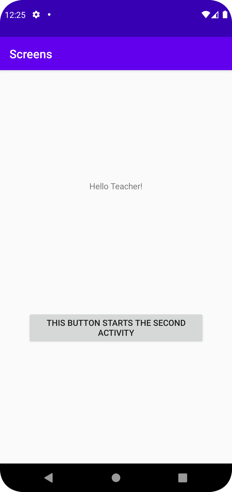
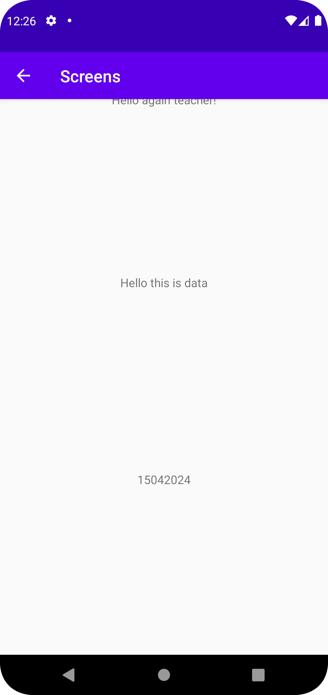

# Rapport

**Skriv din rapport här!**

Det som gjordes i denna uppgift var att skapa en aktivitet utöver den som finns i MainActivity.java.
Det första som gjordes var att fixa med versionerna för att få programmet att fungera med projektet.
Sedan skapades en knapp i activity_main.xml. Knappen gavs id:t button genom koden:
android:id="@+id/button"
Sedan tilldelades knappen en variabel i filen MainActivity.java genom koden:
Button secondActivityButton = findViewById(R.id.button);
Denna kod hittar id:t på knappen som skapades i layout filen och tilldelar den ett värde som sedan kunde 
användas i java filen. 
Sedan skapades en onClickListener genom koden:
secondActivityButton.setOnClickListener(new View.OnClickListener()
detta gjorde att när knappen klickades så kördes den kod som befann sig efter listenern startades.
Det som kod som kördes när knappen klickades skapade en ny intent. Intenten bytte till filen Second_Activity.java och skickade 
med en bundle med två extras som var ett meddelande samt ett datum. 
I filen Second_Activity.java hänvisar koden till layout filen activity_second.xml vilket innebar att det behövde göras ändringar
i den layout filen för att bestämma vad som visas på skärmen. Därmed skapades tre textview element i layout filen där två av de skulle användas
för att visa de extras som skickades med från intenten. I Second_Activity.java skrevs koden:
TextView textView1 = findViewById(R.id.extratext1);
TextView textView2 = findViewById(R.id.extratext2);
För att hämta den textview elementen som skrivits i layout filen och kunna ändra texten genom kod.
Sedan kunde bundle extras hämtas genom koden:
Bundle extras = getIntent().getExtras();
Denna kod hämtar extra datan från intenten vilket möjligör att spara respektive extra till en egen variabel
Detta gjordes på följande sätt:
String extraMessage = extras.getString("Message");
String extraDate = extras.getString("Date");
När extra datan var sparad till sina variabler fungerade metoden "setText()" för att ändra den texten som visades
i respektive textview element.
Den sista saken som gjordes var göra det möjligt att gå tillbaka till den första aktiviteten från den 
andra aktiviteten. Detta gjordes genom att lägga till koden:
android:parentActivityName=".MainActivity"
I filen AndroidManifest.xml. Detta gjorde så att den första aktiviteten blev parent till den andra och det gick då att
klicka på tillbaka pilen för att komma tillbaka till den första aktiviteten.
Såhär så appen ut när den var klar:
Första aktivitet(MainActivity):

Andra aktivitet(Second_Activity):


## Följande grundsyn gäller dugga-svar:

- Ett kortfattat svar är att föredra. Svar som är längre än en sida text (skärmdumpar och programkod exkluderat) är onödigt långt.
- Svaret skall ha minst en snutt programkod.
- Svaret skall inkludera en kort övergripande förklarande text som redogör för vad respektive snutt programkod gör eller som svarar på annan teorifråga.
- Svaret skall ha minst en skärmdump. Skärmdumpar skall illustrera exekvering av relevant programkod. Eventuell text i skärmdumpar måste vara läsbar.
- I de fall detta efterfrågas, dela upp delar av ditt svar i för- och nackdelar. Dina för- respektive nackdelar skall vara i form av punktlistor med kortare stycken (3-4 meningar).

Programkod ska se ut som exemplet nedan. Koden måste vara korrekt indenterad då den blir lättare att läsa vilket gör det lättare att hitta syntaktiska fel.

```
function errorCallback(error) {
    switch(error.code) {
        case error.PERMISSION_DENIED:
            // Geolocation API stöds inte, gör något
            break;
        case error.POSITION_UNAVAILABLE:
            // Misslyckat positionsanrop, gör något
            break;
        case error.UNKNOWN_ERROR:
            // Okänt fel, gör något
            break;
    }
}
```

Bilder läggs i samma mapp som markdown-filen.


Läs gärna:

- Boulos, M.N.K., Warren, J., Gong, J. & Yue, P. (2010) Web GIS in practice VIII: HTML5 and the canvas element for interactive online mapping. International journal of health geographics 9, 14. Shin, Y. &
- Wunsche, B.C. (2013) A smartphone-based golf simulation exercise game for supporting arthritis patients. 2013 28th International Conference of Image and Vision Computing New Zealand (IVCNZ), IEEE, pp. 459–464.
- Wohlin, C., Runeson, P., Höst, M., Ohlsson, M.C., Regnell, B., Wesslén, A. (2012) Experimentation in Software Engineering, Berlin, Heidelberg: Springer Berlin Heidelberg.
